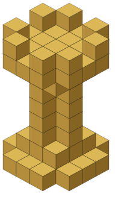

<div align="center">
  

  # Rooke

  **A 3D chess app that shows its work.**
</div>

---

Most chess engines are black boxes you get a move, not a reason. I built Rooke because I wanted to actually "see" how a chess AI thinks, not just get outplayed by one. It's a 3D chessboard where every candidate move the engine considers gets streamed to the screen in real time: the evaluation score, the depth, the line it's calculating. You watch it change its mind before it commits.

It's aimed at people who are still learning the game (myself included) and want some visual intuition for why the "obvious" move is sometimes a trap.

Built with **TypeScript**, **Three.js**, and **GSAP**.

---

## Getting Started

```bash
git clone https://github.com/kaificial/Rooke.git
cd Rooke
npm install
npm run dev
```

That spins up a local dev server via Vite. Open the printed `localhost` URL and you're in.

Other useful scripts:

```bash
npm run build     # type-check + production build to dist/
npm run preview   # preview the production build locally
npm start         # serve the built app with the Express server (server.cjs)
```

---

## Gameplay Guide

### Game Modes
- **Sandbox** — free play. Move pieces, test positions, play a friend on the same board. No engine, no pressure.
- **VS AI** — challenge the Rooke engine. This is where the "AI Thought Process" panel comes alive, showing each candidate move as the engine searches, with a toggle to show/hide it if you'd rather just play.

### Camera Controls
The board lives in a full 3D scene via `OrbitControls`:
- **Rotate** — left click + drag
- **Zoom** — scroll wheel / trackpad
- **Pan** — right click + drag

---

## How the Engine Thinks

The AI runs off the main thread in a Web Worker (`chess-ai.worker.ts`) so the 3D scene never stutters while it searches. Under the hood it's a from-scratch implementation of:

- **Minimax with alpha-beta pruning** to cut down the search tree
- **Quiescence search** on the leaf nodes so it doesn't stop calculating mid-capture and misjudge a position (the classic "horizon effect")
- **MVV-LVA move ordering** (Most Valuable Victim, Least Valuable Attacker) to search the promising captures first and prune more aggressively
- **Piece-square tables** so pieces are evaluated by *where* they are, not just what they are

Every candidate the search visits at the root gets posted back to the UI as a `thinking` message — score, depth, principal variation, node count — which is what powers the live visualization. It's not the strongest engine on the block; it's an honest one.

---

## Tech Stack

| Layer | Tools |
|---|---|
| Core | TypeScript |
| 3D Graphics | Three.js |
| Animation | GSAP |
| Styling | Tailwind CSS + PostCSS |
| Build | Vite |
| Prod Server | Express |

---

## File Structure

```text
├── src/
│   ├── main.ts             # Entry point, 3D scene, UI, game orchestration
│   ├── chess-ai.worker.ts  # The engine: minimax, alpha-beta, quiescence, move ordering
│   ├── style.css           # Global styles & Tailwind
│   └── ...                 # Assets and helper modules
├── public/                 # Static assets, logo, cinematics
├── index.html              # App shell
├── server.cjs              # Express server for production builds
├── package.json            # Dependencies & scripts
└── tsconfig.json           # TypeScript config
```

---

## Why "Rooke"

Chess AI has always felt a little intimidating from the outside so this is my attempt to try something new. 

Contributions, issues, and "hey your move ordering is wrong", etc. corrections are all welcome.

---

Kai Kim, 2026
